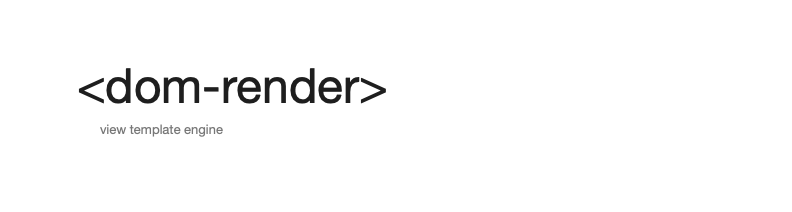

[](https://www.npmjs.com/package/dom-render) [](LICENSE.md) [](https://discord.gg/PW56dpns) [](https://github.com/visualkhh/dom-render)
# Our primary goals are
- view template engine
- Dom control and reorder using web component
---

# 🚀 Quick start 
```shell
npm install dom-render
````
---
# 😃 examples
- [examples project](./example)
--- 

# 📄 Code description
## initialized
```html
<!doctype html><html lang="en"><body id="app"></body></html>
```
```typescript
const target = document.querySelector('#app');
const data = DomRender.run({name: 'my name is dom-render'}, target);
data.name = 'modify name';
```
## print and call
```html
<div>${this.name}</div>
<div>${this.office.addr.first}, ${this.office.addr.last}, ${this.office.addr.street} (${this.office.name})</div>
<div dr="this.office.addr.street">${this.getOfficeFullAddr()}</div>
```
## dr-if
```html
<div dr-if="true">true</div>
<div dr-if="this.gender==='M'"> gender: M</div>
```
## dr-for, dr-for-of
```html
<div dr-for="var i = 0; i < this.friends.length; i++"> friend</div>
<div dr-for-of="this.friends"> ${#it#.name}</div>
<div dr-for="var i = 1 ; i <= 9 ; i++" dr-it="i">
    ${#it#} *
    <scope dr-for="var y = 1 ; y <= 9 ; y++" dr-it="y" dr-var="superIt=#it#" dr-strip="true">
        #it# = ${var.superIt * #it#}
    </scope>
</div>
```

## dr-inner-text, dr-inner-html
```html
<div dr-inner-text="'<b>aa</b> <button dr-event-click=\'alert(1)\'>aa</button>'"> friend</div>
<div dr-inner-html="'<b>aa</b> <button dr-event-click=\'alert(1)\'>aa</button>'"> friend</div>
```

## event
dr-event-(name) 
- click, mousedown, mouseup, dblclick, mouseover, mouseout, mousemove, mouseenter, mouseleave, contextmenu, keyup, keydown, keypress, change, input, submit, resize, focus, blur
- ref: element 
- variable: $event, $target
```html
click: <button dr-event-click="this.name = 'name' + new Date()">click</button> <br>
change: <input type="text" dr-event-change="this.name = $target.value"> <br>
input: <input type="text" dr-event-input="this.name = $target.value"> <br>
keyup: <input type="text" dr-event-keyup="this.name = $target.value"> <br>
...
keydown: <input type="text" dr-event-keydown="this.name = $target.value"><br>
submit: <form dr-event-submit="console.log($event); $event.preventDefault();"><input type="text"> <button type="submit">submit</button></form><br>
```

dr-window-event-popstate
- ref: window 
- variable: $target
```html
window-event-popstate: <input type="text" dr-window-event-popstate="alert(this.name)"><br>
```

dr-event
- other event
- ref: element
- variable: $params, $event
```html
<input dr-event:bind='eventName1, eventName2' dr-event="console.log('event', $params, $event)"  type="text">
```

## dr-value, value-link
```html
dr-value: <input type="text" dr-value="this.office.name"> <br>
dr-value-link: <input type="text" dr-value-link="this.office.addr.street"> <br>
```

## dr-attr
```html
<textarea dr-attr="{rows: this.age/2, cols: this.age}"></textarea>
```

## dr-style
```html
<div dr-style="{fontSize: this.age+'px'}"> style </div>
```


## dr-strip
as-is
```html
<div dr-strip="true"><span>hello</span></div>
```
to-be
```html
<span>hello</span>
```

## dr-on-init
```html
<input dr-on-init="this.onInitElement">
```

## dr-before, dr-after
```html
<div dr-before="console.log('process before')" dr-after="console.log('process after')"></div>
```
## dr-complete
```html
<select dr-value-link="this.currentContry" dr-event-change="this.contryChange($event)">
    <option dr-for-of="this.languages" dr-value="#it#.key" dr-complete="this.currentContry='defaultValue'">${#it#.title}</option>
</select>
```

---

# script
```typescript
new DomRender.run(obj, target, {
  scripts: {
    concat: function (head: string, tail: string) {
      return head + tail; 
    }
  }
});
```
using script
```typescript
const data = config.scripts.concat('head', 'tail')
```
```html
<div>${$scripts.concat('head', 'tail')}</div>
<div dr-if="$scripts.concat('wow', 'good') === 'wowgood'"> is wowgood</div>
```

---
# component
```typescript
export namespace Profile {
  export const templat = '<div>aaaaa${this.name}aaaaa </div>';
  export const styles = ['p {color: red}', 'div {margin: ${this.margin} + \'px\' }'];
  export class Component {
    public name = 'default name';
    public margin = 5;
    public say() {
        console.log('say!~')
    }
  }
}

new DomRender.run(obj, target, {
  targetElements: [
    RawSet.createComponentTargetElement('my-element', (e, o, r) => new Profile.Component(), Profile.templat, Profile.styles, scripts)
  ],
});
```
using component
```html
<my-element dr-on-init="$component.say();"></my-element>
```
- attribute
  - dr-on-init: component created init call script
    - $component: component  instance
    - $element: element instance
    - $attribute: element attribute object
    - $innerHTML: element innerHTML string
---

# LifeCycle
```
* OnInitRender
  - onInitRender(): init render call
```
----
# License
* MIT
* visualkhh@gmail.com
